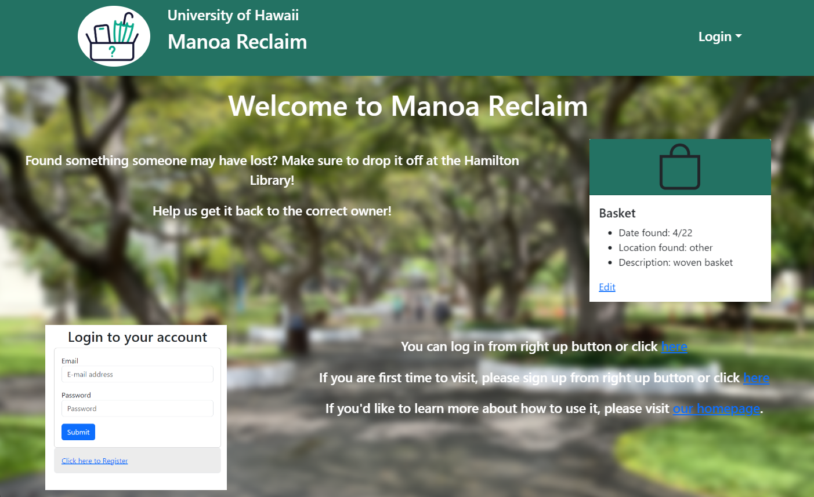

Manoa reclaim is a web application that I helped create as a team project in ICS 314, Spring 2024. The project helped me learn how to design and implement a responsive web site and team work for web application.

This is implemented using [Meteor](http://meteor.com), a JavaScript application platform. Within two weeks, we created a website that poeple registering their lost itmes or found items.

In this project I gained experience with full-stack web application design and associated technologies, including [MongoDB](http://mongodb.com) for database storage, the [Twitter Bootstrap](http://getbootstrap.com/) CSS Framework for the user interface, and Javascript for both client and server-side programming. 

This is our home page for Users: <a href="https://manoa-reclaim.github.io/">Manoa Reclaim</a>
