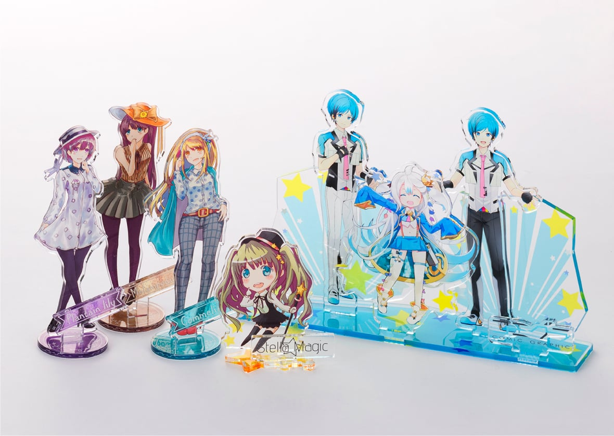
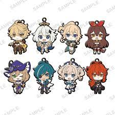

## What do you think when you hear about my own good?

 Some anime fans like to collect goods of their favorite characters. I am one of them and collect various goods. For example,  a "rubber strap," or "rubber keychain," typically refers to a strap made of rubber that is commonly used to secure items such as mobile phones, keys, cameras, or other accessories and there are often uesd by characters from anime, games, or other pop culture icons or  “Acrylic stands”, which are made of transparent, hard acrylic (a kind of plastic) and are often printed with motifs of anime and game characters. It can be displayed on a shelf or desk. In addition, it has a handheld part, and we can take pictures with it, etc.
 These kinds of goods are popular among anime and video game fans. As I explained above, these goods are basically prints of video game and anime characters, but I made an acrylic stand with myself printed on it and sold it to good friends. I won't go into details to avoid identification, but it got a good response. I’ll put some of image of acrylic stands and rubber straps.
 

  
  

