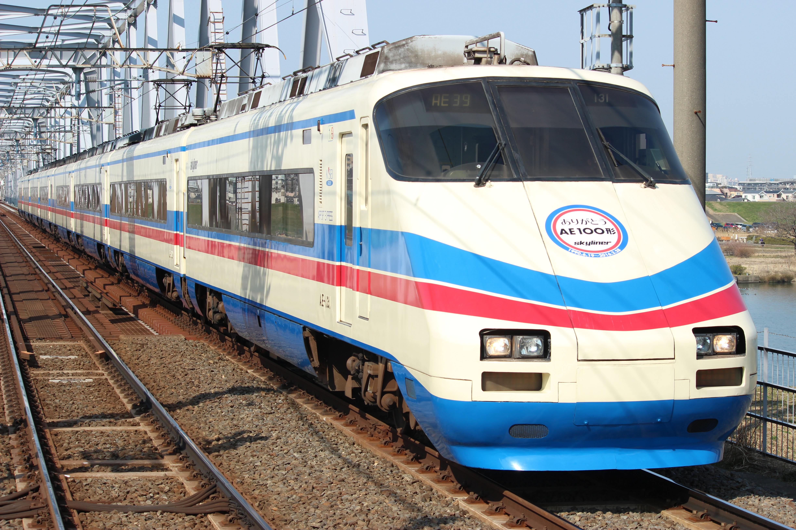
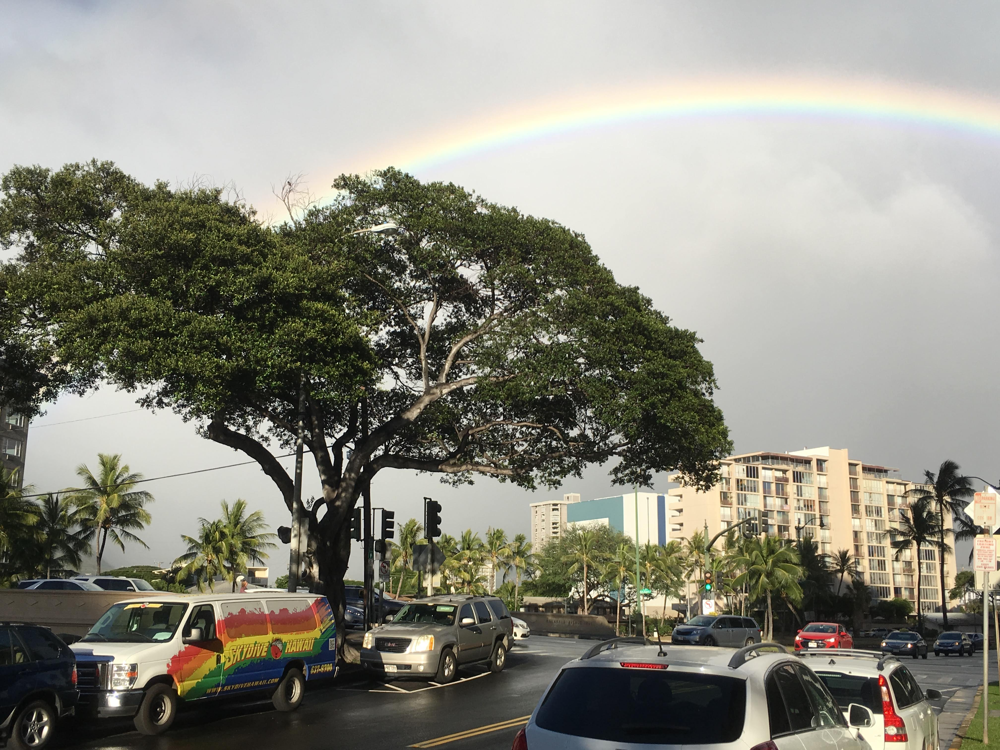
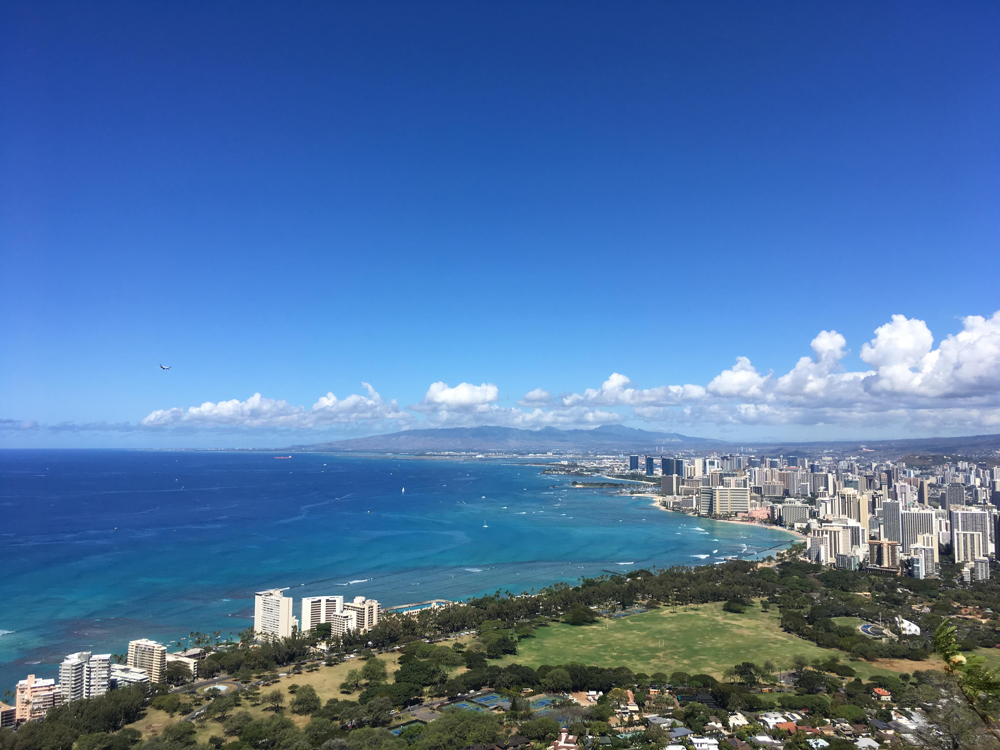
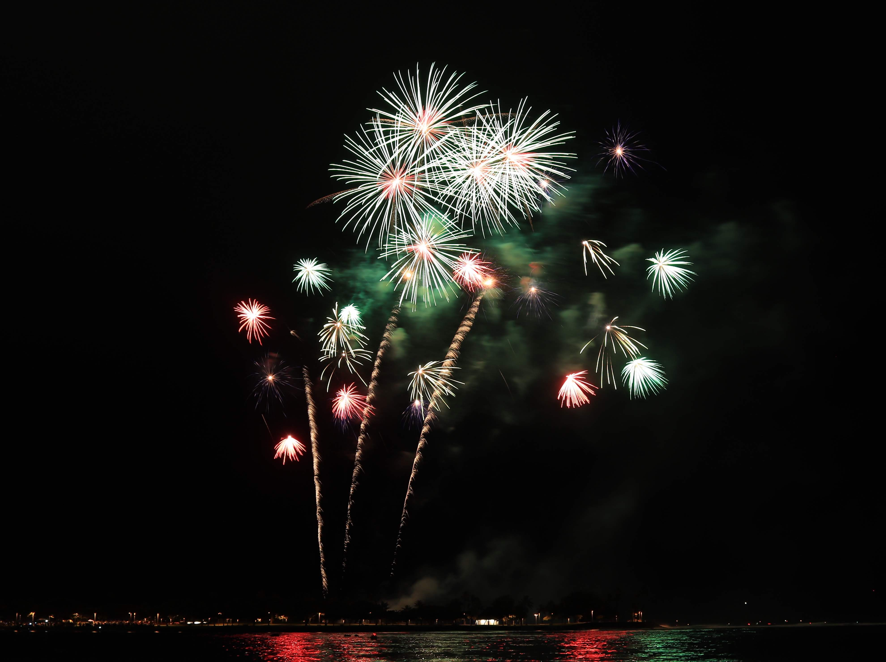
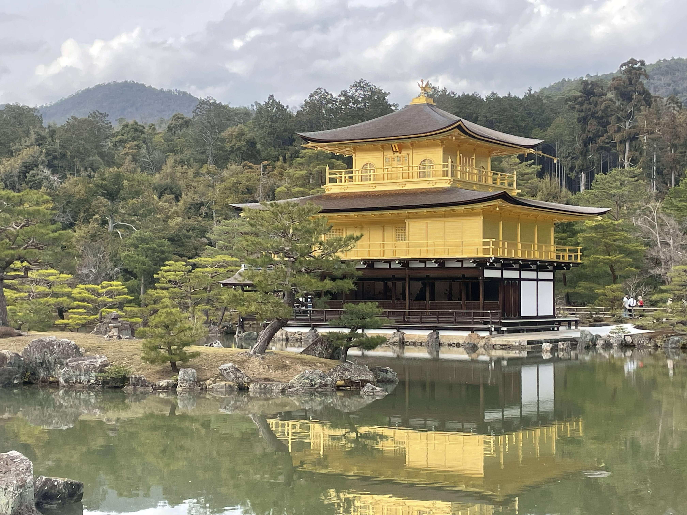
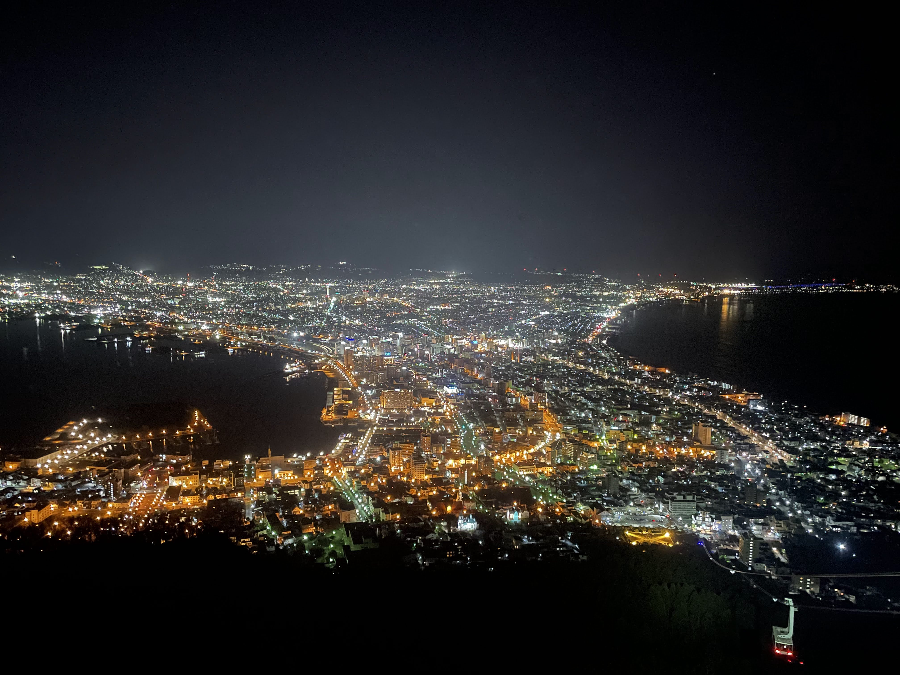
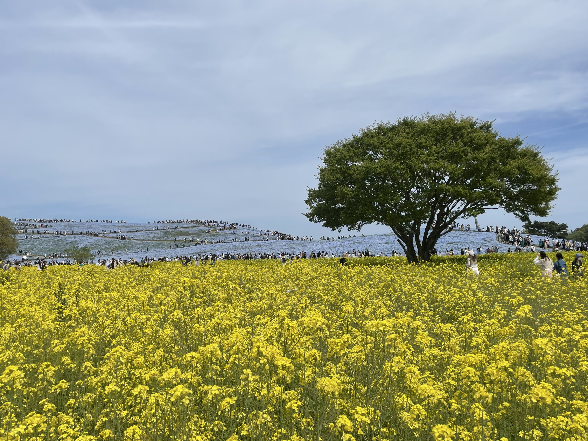

I have no project to put on this page yet. So I will introduce my hobby project, taking pictures.
One of my interests is taking pictures. I met a camera when I was in high school. My friend invited me to a camera club and he said I can travel anywhere! I like to travel in Japan by train so I was delighted and joined in! These are pictures which I took while in high school. He helped me learn the basics about photography, and got me started in this new hobby!

  
  

After I came to Hawaii, everything was new and various nature shots were taken. My friends who I met in language school often called me to go hiking, to the beach, and some famous places where tourists should go . So I was taking photos of mountains, the ocean with Hawaiian nature, fireworks, and night view etc… These experiences gave me a new perspective.

  
  
  

Last summer, I went back to Japan for vacation and I traveled around Japan. It was nice and took nice photos. I put these memories together finally.  

  
  
  

