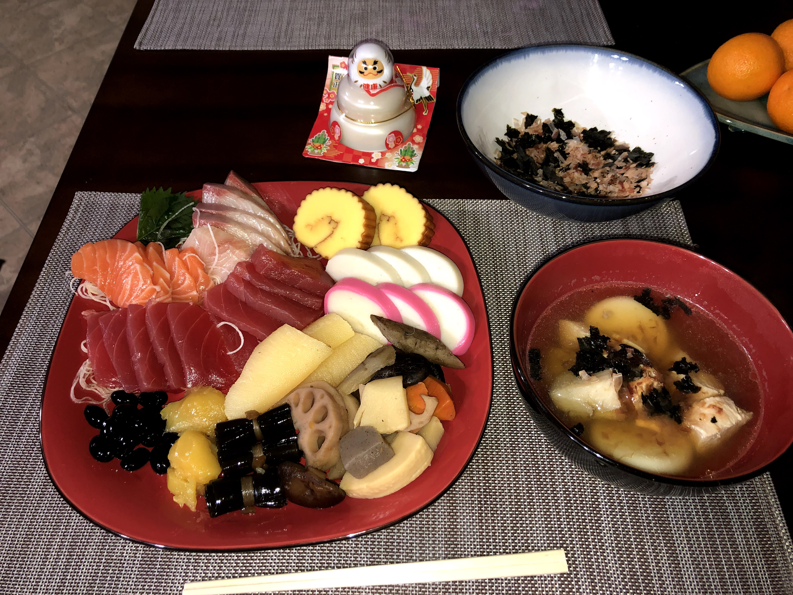
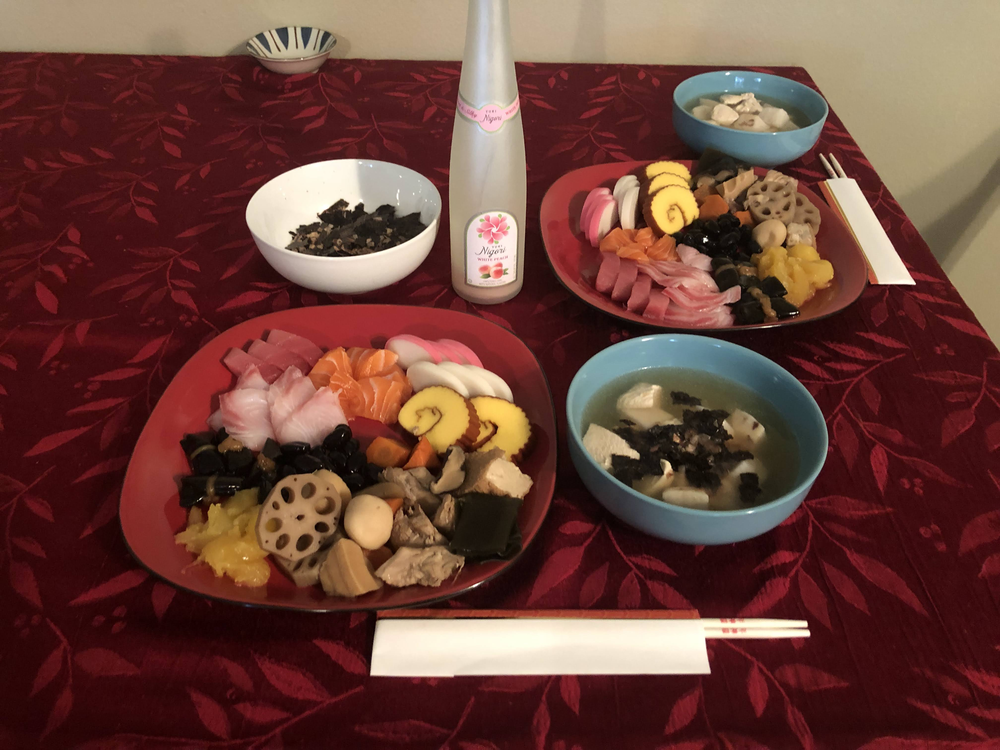

  
  

One of my good skills is cooking. I am especially good at making Japanese food. Since I was child, I helped my family to cook dinner or lunch. I am currently living alone, away from my parents so I need to cook by myself to survive. Thanks to this, I can say that my cooking skills are very high, although not professional.
One of my signature dishes is Osechi. Osechi is a traditional Japanese New Year's cuisine consisting of a variety of specially prepared dishes, each carrying symbolic meaning and significance. Inside of osechi is known for its emphasis on auspicious colors, flavors, and ingredients believed to bring good luck, prosperity, and happiness in the coming year.　The bowl next to it is called "ozoni" and it is a simple soup enjoyed with Osechi. It typically consists of a clear broth with pieces of mochi (rice cakes), vegetables, and sometimes chicken or seafood. People often prepare Ozoni with regional variations, and it's also considered a symbol of good luck and a fresh start in the new year.
I cook for my roommate and It has become a popular dish every year.(The pictures are my Osechi and Ozoni in recent years)
